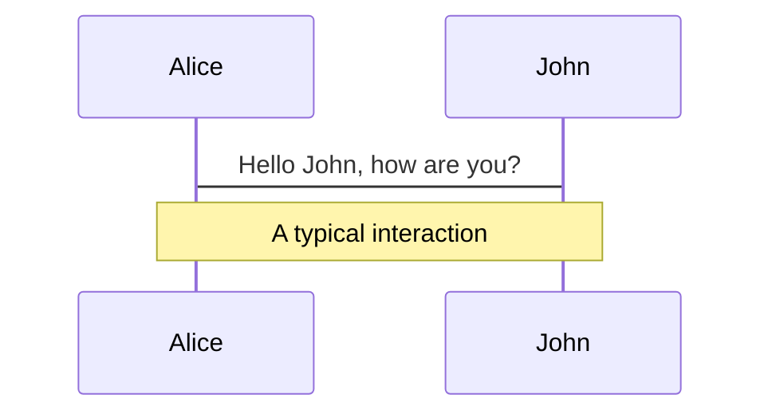
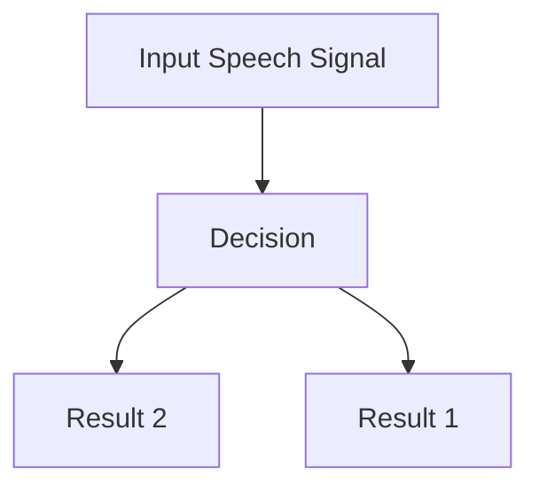
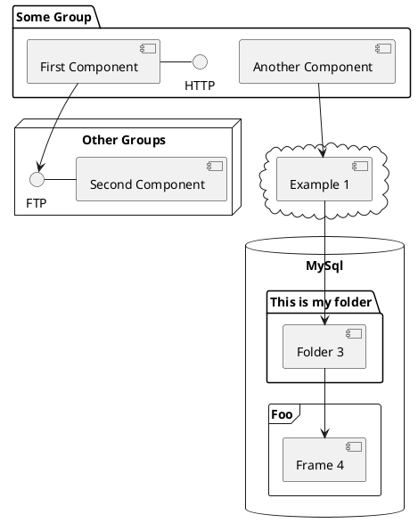

---
# try also 'default' to start simple
theme: apple-basic

image: https://images.unsplash.com/photo-1534077777481-51383522d350?ixlib=rb-4.0.3&ixid=MnwxMjA3fDB8MHxwaG90by1wYWdlfHx8fGVufDB8fHx8&auto=format&fit=crop&w=1738&q=80
layout: intro-image
# random image from a curated Unsplash collection by Anthony
# like them? see https://unsplash.com/collections/94734566/slidev
# apply any windi css classes to the current slide
# https://sli.dev/custom/highlighters.html
highlighter: shiki
# show line numbers in code blocks
lineNumbers: false
# some information about the slides, markdown enabled
info: |
  ## Slidev Starter Template
  Presentation slides for developers.

  Learn more at [Sli.dev](https://sli.dev)
# persist drawings in exports and build
drawings:
  persist: false
# use UnoCSS
css: unocss
---

  
    Kevin Kunkel
     
    Graph-Seminar 23.01.23
  

  <h1>Image Encryption Algorithm</h1>
  
Using Graph Theory and Speech Signal Key Generation

<!--
The last comment block of each slide will be treated as slide notes. It will be visible and editable in Presenter Mode along with the slide. [Read more in the docs](https://sli.dev/guide/syntax.html#notes)
-->

---

# Contents

 

- **Introduction** - focus on the content with Markdown, and then style them later
- **Proposal** - theme can be shared and used with npm packages
- **Encryption** - code highlighting, live coding with autocompletion
- **Decryption** - embedding Vue components to enhance your expressions
- **Key-Generation** - built-in recording and camera view
- **Parameter-Analysis** - export into PDF, PNGs, or even a hostable SPA
- **Conclusion** - anything possible on a webpage

 
 

---

# Entropy Measures of Proposed Algorithm

 
 

| **Color Image** | **Entropy Original Image** | **Entropy Encrypted Image** |
| --- | ------- | -------- |
| Baboon | 7.6128 | 7.9988 |
| Lena | 7.7599 | 7.9987 |
| Pepper | 7.7749 | 7.9987 |
| Mona Liza | 7.3808 | 7.9981 |

---
layout: image-right
image: https://images.unsplash.com/photo-1562770584-eaf50b017307?ixlib=rb-4.0.3&ixid=MnwxMjA3fDB8MHxwaG90by1wYWdlfHx8fGVufDB8fHx8&auto=format&fit=crop&w=1902&q=80
---

# Introduction

 

- Developement of network technology and multimedia
- Increased transfer of images
- Need of secure transfer of images
- Many use cases for encryption (military, governments)
- Developement of models combining encryption and authorization methods

---

# Arnold's Transformation: Example

 
 

**Figure 1:** Examples of an Image subjected to Arnold’s Transform, (a) Original Image, (b) Image
obtained after 1st iteration, (c) Image obtained after 2nd iteration, (d) Image obtained after 384th
iteration

---

# Arnold's Transformation

 

- Periodic chaotic map (an evolution function) that exhibits some sort of chaotic behavior
- Used to create randomness in the signal when applied to the signal. Here Arnold’s transform is achieved using the following matrix equation

 

$$
\begin{array}{c}

\nabla \times \vec{\mathbf{B}} -\, \frac1c\, \frac{\partial\vec{\mathbf{E}}}{\partial t} &
= \frac{4\pi}{c}\vec{\mathbf{j}}    \nabla \cdot \vec{\mathbf{E}} & = 4 \pi \rho \\

\nabla \times \vec{\mathbf{E}}\, +\, \frac1c\, \frac{\partial\vec{\mathbf{B}}}{\partial t} & = \vec{\mathbf{0}} \\

\nabla \cdot \vec{\mathbf{B}} & = 0

\end{array}
$$

 

- Where $(x',y')$ represents the new position of the pixel, whereas the $(x,y)$ the original position

 

---

# Proposal

You can create diagrams / graphs from textual descriptions, directly in your Markdown.

[Learn More](https://sli.dev/guide/syntax.html#diagrams)
---

# Scanning Methodology

 

co

---

# Encryption-Algorithm

 

- **Input:** Original color image (256x265px), speech signal, scan pattern
- **Output:** Cipher color image
- **Step 1:** Input the color image
- **Step 2:** Read the color image and then split it in to into R, G, and B levels. For each input matrix
- level (R, G and B), divide the color image into 16 sub-blocks of size 64×64 pixels.
- **Step 3:** Get the starting a modified Spiral S scan to read the values from each sub-block and save them at new block of same size (64×64) Then collect all blocks at new scrambling image of size
(64×64). Show Figure 4. and Table 1.
- **Step 4:** Divide each level (R, G and B) into 64 sub-block of length 32*32 pixel at each level do the following steps:
  - Convert each block to the vector of length 1024 value.
  - Divide the vector into 4 vectors each of which have 256 value.
  - Perform XOR operation between the four vectors and secret key vectors. Form the keys matrix
  selected two keys of length 512 then divide each key into two keys of length 256.
  - Perform XOR between the vector and the first part of secret key, the result of this operation has
been xored again to the second part of secret key.
  - Convert back the four vectors into one vector then convert it back to sub block of 32×32 pixels.
  - Use Arnold transform for each sub-block.
- **Step 5:** Combine the 64 sub-blocks back into an encrypted color image of size 256×256.
- **Step 6:** Store the cipher color image.

  

---

# Decryption-Algorithm

 

- **Input:** Cipher image, described color image
- **Output:** Color image
- **Step 1:** Input the cipher color image of sizes 256×256px
- **Step 2:** Divide each level (R, G and B) into 64 sub-block of length 32×32 pixels at each level do the
following steps:
  - Use Arnold transform for each sub-block.
  - Convert each block to the vector of length 1024 values.
  - Divide the vector into 4 vectors each of which have 256 values.
  - Perform XOR between the vector and the first part of secret key, the result of this operation has been xored again to the second part of secret key
  - Perform XOR operation between the four vectors and secret key vectors. Form the keys matrix selected two keys of length 512 then divide each key into two keys of length 256.
  - Convert back the four vectors into one vector then convert it back to sub block of 32×32
pixels.
(64×64). Show Figure 4. and Table 1.
- **Step 3:** Combine the 64 sub-blocks back into a decrypted color image of size 256×256 pixels.
- **Step 4:** Read the decrypted color image then divids it in to into R, G, and B levels. For each input
matrix level (R, G and B), divide the decrypted color image into 8 sub-blocks of size 64×64 pixels.
- **Step 5:** Get the starting a modified Spiral S scan to return the values from each sub-block to the real
position and save them at new block of same size (64×64 pixels). Then collect all blocks at new
descrambling image of size (64×64 pixels). 
- **Step 6:** Combine the 16 sub-blocks back into a descrambled color image of size 256×256 pixels
- ***Step 7:** Store the decrypted color image.

  

---

# Key-Generation (Using Graph Theory)

---

# Conclusion

 

---

# Sources

[Documentations](https://sli.dev) · [GitHub](https://github.com/slidevjs/slidev) · [Showcases](https://sli.dev/showcases.html)
